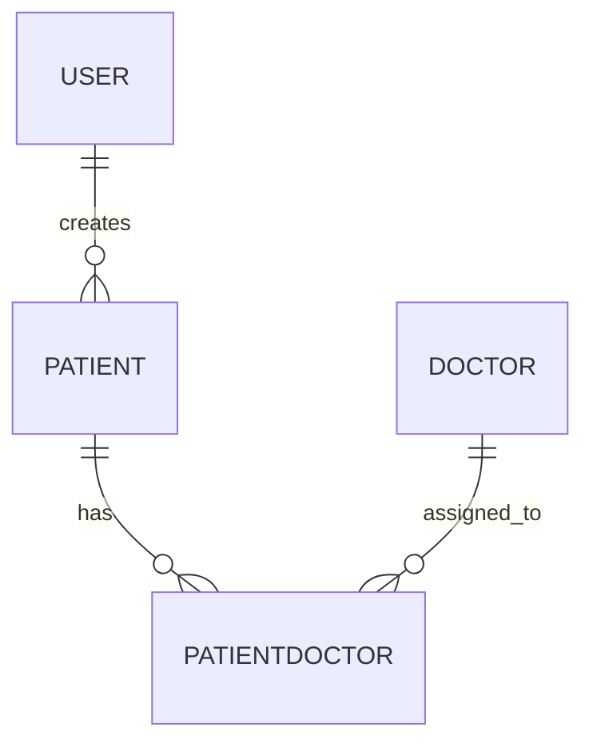

# Healthcare Backend Application

This is a backend application for managing healthcare records, built using Node.js, Express.js, and PostgreSQL. It implements JWT authentication and provides RESTful API endpoints for managing patient and doctor records, as well as patient-doctor mappings.

---

## Table of Contents

- [Installation](#installation)
- [Environment Variables](#environment-variables)
- [Usage](#usage)
- [API Endpoints](#api-endpoints)
  - [Authentication](#authentication)
  - [Doctors](#doctors)
  - [Patients](#patients)
  - [Patient-Doctor Mappings](#patient-doctor-mappings)
- [Authorization](#authorization)
- [Models Description](#models-description)
- [ER Diagram](#er-diagram)
- [Dependencies](#dependencies)
- [Project Structure](#project-structure)
- [License](#license)

---

## Installation

1. **Clone the repository:**

   ```bash
   git clone https://github.com/sarthaks225/healthcare-backend.git
   cd healthcare-backend
   ```

2. **Install dependencies:**

   ```bash
   npm install
   ```

3. **Create a `.env` file in the root directory and add your PostgreSQL database credentials:**

   ```
   DB_HOST=localhost
   DB_PORT=5432
   DB_USER=your_database_user
   DB_PASSWORD=your_database_password
   DB_NAME=your_database_name

   JWT_SECRET=your_jwt_secret
   PORT=8000
   ```

4. **Run the application:**
   ```bash
   npm start
   ```

---

## Environment Variables

| Variable    | Description                         |
| ----------- | ----------------------------------- |
| DB_HOST     | PostgreSQL host (e.g., localhost)   |
| DB_PORT     | PostgreSQL port (default: 5432)     |
| DB_USER     | PostgreSQL username                 |
| DB_PASSWORD | PostgreSQL password                 |
| DB_NAME     | PostgreSQL database name            |
| JWT_SECRET  | Secret key for JWT authentication   |
| PORT        | Port for the server (default: 8000) |

---

## Usage

- Use tools like **Postman** or **curl** to interact with the API endpoints.
- For protected routes, include the JWT token in the `Authorization` header as `Bearer <token>`.

---

## API Endpoints

### Authentication

| Method | Endpoint             | Description                                 | Auth Required |
| ------ | -------------------- | ------------------------------------------- | ------------- |
| POST   | `/api/auth/register` | Register a new user (name, email, password) | No            |
| POST   | `/api/auth/login`    | Log in and receive a JWT token              | No            |

---

### Doctors

| Method | Endpoint           | Description                   | Auth Required | How to Authorize   |
| ------ | ------------------ | ----------------------------- | ------------- | ------------------ |
| POST   | `/api/doctors`     | Add a new doctor              | Yes           | Bearer Token (JWT) |
| GET    | `/api/doctors`     | Retrieve all doctors          | No            | -                  |
| GET    | `/api/doctors/:id` | Retrieve a doctor by ID       | No            | -                  |
| PUT    | `/api/doctors/:id` | Update a doctor's information | Yes           | Bearer Token (JWT) |
| DELETE | `/api/doctors/:id` | Delete a doctor               | Yes           | Bearer Token (JWT) |

---

### Patients

| Method | Endpoint            | Description                    | Auth Required | How to Authorize   |
| ------ | ------------------- | ------------------------------ | ------------- | ------------------ |
| POST   | `/api/patients`     | Add a new patient              | Yes           | Bearer Token (JWT) |
| GET    | `/api/patients`     | Retrieve all patients          | No            | Bearer Token (JWT) |
| GET    | `/api/patients/:id` | Retrieve a patient by ID       | No            | Bearer Token (JWT) |
| PUT    | `/api/patients/:id` | Update a patient's information | Yes           | Bearer Token (JWT) |
| DELETE | `/api/patients/:id` | Delete a patient               | Yes           | Bearer Token (JWT) |

---

### Patient-Doctor Mappings

| Method | Endpoint                   | Description                                    | Auth Required | How to Authorize   |
| ------ | -------------------------- | ---------------------------------------------- | ------------- | ------------------ |
| POST   | `/api/mappings`            | Assign a doctor to a patient                   | Yes           | Bearer Token (JWT) |
| GET    | `/api/mappings`            | Retrieve all patient-doctor mappings           | No            | Bearer Token (JWT) |
| GET    | `/api/mappings/:patientId` | Get all doctors assigned to a specific patient | No            | Bearer Token (JWT) |
| DELETE | `/api/mappings/:id`        | Remove a doctor from a patient                 | Yes           | Bearer Token (JWT) |

---

## Authorization

- **Bearer Token (JWT)** is required for all protected endpoints.
- After logging in (`/api/auth/login`), include the token in the `Authorization` header for requests:
  ```
  Authorization: Bearer <your-jwt-token>
  ```

---

## Models Description

### User

- **Fields:** `id`, `name`, `email`, `password`, `createdAt`, `updatedAt`
- **Description:** Stores user credentials for authentication.

### Patient

- **Fields:** `id`, `name`, `age`, `medicalHistory`, `createdAt`, `updatedAt`
- **Description:** Stores patient details.

### Doctor

- **Fields:** `id`, `name`, `specialty`, `phone`, `email`, `createdAt`, `updatedAt`
- **Description:** Stores doctor details.

### PatientDoctor (Mapping)

- **Fields:** `id`, `patientId`, `doctorId`, `createdAt`, `updatedAt`
- **Description:** Maps patients to doctors (many-to-many relationship).

---

## ER Diagram



- **USER**: Registers and manages patients.
- **PATIENT**: Can be assigned to multiple doctors.
- **DOCTOR**: Can be assigned to multiple patients.
- **PATIENTDOCTOR**: Join table for many-to-many relationship.

---

## Dependencies

- **express**: Web framework for Node.js
- **sequelize**: ORM for PostgreSQL
- **pg**: PostgreSQL client for Node.js
- **jsonwebtoken**: For JWT authentication
- **bcryptjs**: For password hashing
- **dotenv**: Loads environment variables
- **body-parser**: Parses incoming request bodies
- **cors**: Enables Cross-Origin Resource Sharing

Install all dependencies with:

```bash
npm install
```

---

## Project Structure

```
/controllers      # Route logic (business logic)
/models           # Sequelize models
/routes           # Express route definitions
/middleware       # Authentication middleware
/config           # Database config
/utils            # Utility functions (e.g., JWT helpers)
.env              # Environment variables
app.js            # Entry point
```

---
